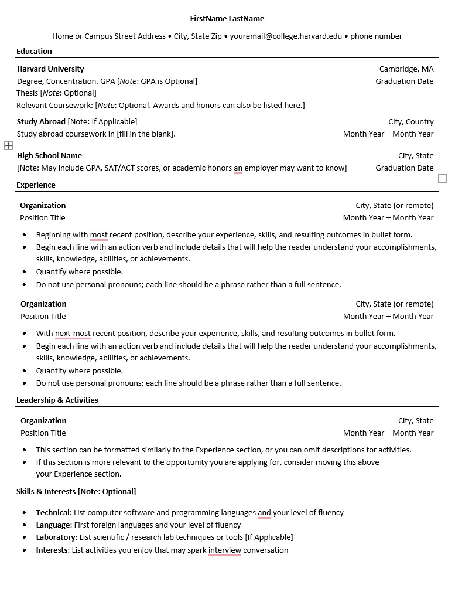
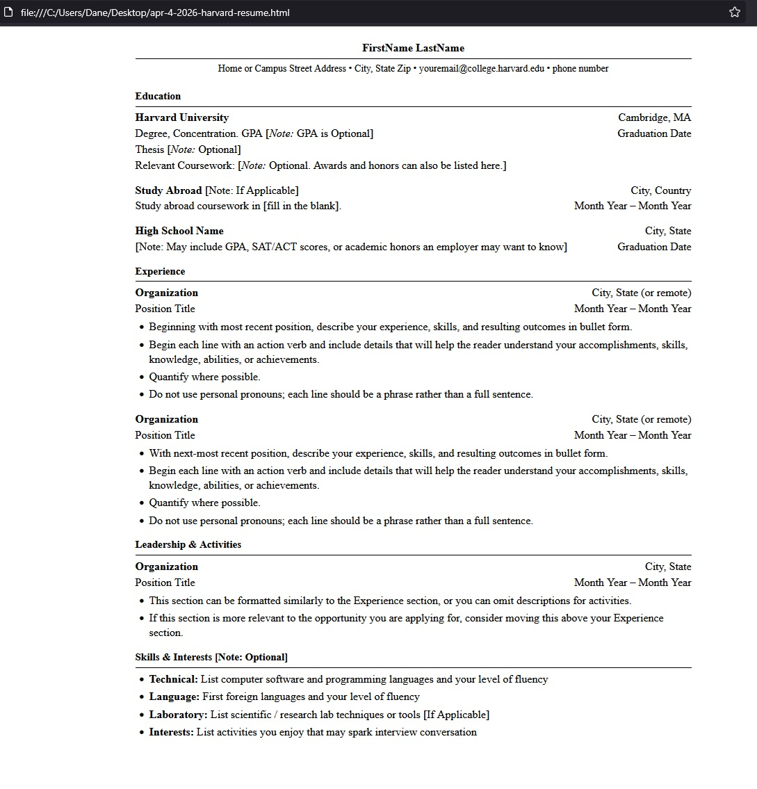

# Frontend Architecture & Setup

This directory contains the frontend code for the Cloud Resume Challenge. The application is a Single Page Application (SPA) designed to serve as a comprehensive professional portfolio, featuring a main home landing page, a dedicated about page, a technical blog, a project showcase, and a data-driven resume.

## Tech Stack
* **Framework:** React 18+ (via Vite)
* **Routing:** React Router v7 (Declarative routing)
* **Styling:** Custom Vanilla CSS (Mobile-first, Glassmorphism theme)
* **Icons:** Lucide-React
* **Hosting:** Azure Static Web Apps
* **CI/CD:** GitHub Actions

## Architecture & Data Flow

The frontend has evolved into a modular, data-driven application to ensure maintainability and separation of concerns.

### 1. Resume Rendering (`ResumeData.js`)
The resume view is based on the traditional Harvard Resume Template format but is rendered dynamically. 
* **Data Layer:** All professional experience, education, and technical skills are stored as a JSON object in `src/data/ResumeData.js`.
* **Component Layer:** React components (`ResumePage.jsx`, `ResumeSectionItem.jsx`) map this data to the DOM.

### 2. Project & Blog Pipeline (Local JSON Model)
To optimize performance and simplify the Azure deployment, we have transitioned from runtime fetching of Markdown files to a **Build-Phase JSON Generation** model.
* **Pre-build Script:** A Node.js script (`generateProjects.cjs`) processes Markdown files in the `/public/data/` directories.
* **Data Sync:** This script compiles metadata and content into `src/data/projectsData.json` and `blogData.json`.
* **State Management:** Components like `HomePage.jsx` and `ProjectsPage.jsx` import these JSON files directly, allowing for instant rendering and easy sorting/filtering.

## Local Development Setup

### Prerequisites
* Node.js & npm

### Installation & Serving

1. **Navigate to the frontend directory:**
   ```sh
   cd frontend
   ```

2. **Install JavaScript dependencies:**
   ```sh
   npm install
   ```

3. **Generate JSON data from Markdown:**
   Run the python invoker to compile the latest projects and blog posts.
   ```sh
   invoke render-blog
   invoke render-projects
   ```

4. **Start the Vite Development Server:**
   *(Note: Do not use `http-server`, as Vite provides Hot Module Replacement and handles React routing).*
   ```sh
   npm run dev
   ```

## Performance & Styling Considerations

* **Glassmorphism UI:** The site utilizes a consistent glass-effect theme using `backdrop-filter: blur()` and semi-transparent gradients. This maintains a modern, high-contrast aesthetic that sits cleanly over the high-detail background texture.
* **Image Optimization:** All heavy assets, such as high-resolution background textures (originally 14MB) and headshots, have been optimized and converted to `.webp` format. This drastically reduces initial load times and bandwidth consumption.
* **Responsive Layouts:** The UI relies on a mobile-first approach. Custom CSS media queries (centralized in `breakpoints.css`) manage the transition from complex horizontal project/resume layouts on desktop to simplified vertical stacks on mobile devices.
* **Visual Hierarchy:** Standardized header gradients (`page_header`) and deliberate use of text shadows are implemented globally to ensure readability against dynamic backgrounds and textured paper elements.
* **Code Formatting:** The codebase is standardized on 4-space indentation to align with the Python-based backend and infrastructure-as-code (Terraform) standards used across the wider project.

---

<details>
<summary><b>Original Technical Specification & Blueprint (Archive)</b></summary>

# Frontend Technicial Specification

- Create a static website that serves an html resume.

## Resume Format Considerations

Resumes are in US are typically accepted in word or pdf format that exclude information. eg. Age, photos, marital status. We typically don't include GPA either.

I'm going to use the [Harvard Resume Template format](https://careerservices.fas.harvard.edu/resources/bullet-point-resume-template/) as the basis of my resume.

### Harvard Resume Format Generation

I'm going to utilize AI to generate the HTML and possibly the CSS and from there I will customize the code to my preferred liking.

Prompt to Gemini:

```text
Convert this resume format into html.
Please don't use a css framework.
Please use the least amount of css tags
Please create a downloaded html template file
```

Image provided to Gemini:


This is the [generated output](./docs/apr-4-2026-harvard-resume.html) which I will further customize.

This is what the generated HTML looks like unaltered:



## HTML Adjustments

- I will be applying mobile styling to my website we'll include the viewport meta tag width=device-width so mobile styling scales correctly.
- I'll extract our styles into it's own style sheet after we are happy with the HTML markup
- I'll simplify our HTML css selector to be as possible.
- For the HTML page I'll use 4 spaces because I most use Python and that's standard tab format.

## Serve Static Website Locally

I need to serve the static website locally so I can start using stylesheets 
externally from the HTML page in a Cloud Developer Environment (CDE).

Using the simple web-server http-server

### Install HTTP Server
```sh
npm i http-server -g
```

https://www.npmjs.com/package/http-server

### Server Website

http-server will serve a public folder by default where 
the command is run.

```sh
cd frontend
http-server
```

## Image Size Considertations

I have a background texture that was 14MB.
I'm going to optimize it to webp with an online tool.

## Frontend Framework Consideration

- Chose to use React because its the most popular javascript framework.
- Chose to use Vite.js over webpack because the frontend is very simple
- Configured React Router V7, decided to use declaractive mode because the app is very simple.

## Render Items with Frontmatter

Both my projects and blog posts rely on markdown.
It would be better to collect markdown files with front matter
and turn those into json objects.
Maybe everything contained within a directory for data.

eg. `/projects/:handle.markdown`
eg. `/blog/:handle.markdown`

## Tasks runner with invoker

I am using the task runner invoke and refactor the render_projects into render_items
so it can render the projects and the blog.
```sh
invoke --list
invoke render-blog
invoke render-projects
```
</details>

<details>
<summary><b>Deprecated Architectures & Archive</b></summary>

### Deprecated: Python Task Runner (`invoke`)
The project originally utilized a Python-based task runner (`invoke render-blog`, `invoke render-projects`) to compile Markdown files. This was deprecated and replaced with a Node.js script (`generateProjects.cjs`) to unify the frontend toolchain under a single language (JavaScript/Node), simplifying the CI/CD pipeline and local setup requirements.

### Deprecated: Client-Side Markdown Fetching
Early versions of the site used the browser `fetch` API to retrieve `.md` files from the `/public` directory at runtime. This was deprecated in favor of a build-phase generation model to:
1. Eliminate "Flash of Unstyled Content" (FOUC).
2. Improve SEO by making content available immediately.
3. Allow for easier client-side sorting and filtering of data via JSON.

### Deprecated: Local `http-server`
Early technical specifications suggested using `http-server` for serving a static HTML resume. This was deprecated upon moving to a React Single Page Application (SPA) architecture, as the Vite development server provides necessary Hot Module Replacement (HMR) and handles SPA routing logic.

### Original Technical Specification (Blueprint)
* **Goal:** Create a static website that serves an HTML resume.
* **Format:** Based on the Harvard Career Services bullet-point resume template.
* **Initial Tools:** Pure HTML/CSS optimized via Gemini-assisted code generation.
* **Mobile Scaling:** Initial requirement for `viewport` meta tags and 1:1 scaling for handheld devices.

</details>
